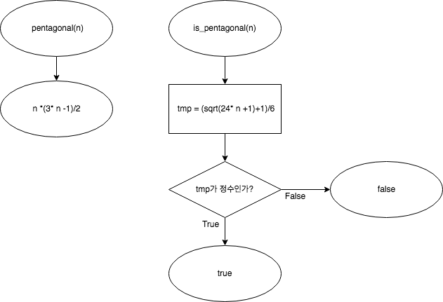

# 오일러 프로젝트

## 44

### 문제 설명
n번째 **오각수**는 `n(3n−1)/2`로 정의된다. 두 오각수의 합도 차도 모두 오각수인 경우에서 두 오각수의 차가 최소가 되는 값을 구하는 문제다.

### 문제를 풀기 위한 알고리즘
- 먼저 최소가 되는 차를 저장하기 위한 변수 `result`를 선언하고, `math.h`의 `INFINITY`로 초기화한다.
- 반복문을 이용해서 일정 범위까지 오각수 `j`, `k`를 순서대로 생성하고 `j+k`, `llabs(k-j)`가 모두 오각수인지 확인한다. 모두 오각수라면, `llabs(k-j)`가 두 오각수의 차가 되므로 이 값이 `result`보다 작을 경우에만 갱신한다.
- 일정 범위 내에서 탐색이 끝난 경우 `result`를 출력한다.

- `pentagonal(n)` 함수는 정수 `n`을 인자로 받아서 `n(3n−1)/2`를 반환한다(int).
- `is_pentagonal(n)` 함수는 정수 `n`을 인자로 받아서 `n`이 오각수인지를 반환한다(bool).
  `n`이 오각수인지 판별하는 방법은 [영문 위키백과의 오각수 문서](https://en.wikipedia.org/wiki/Pentagonal_number#Tests_for_pentagonal_numbers)에서 찾을 수 있었다. `(sqrt(24 * n + 1) + 1) / 6`의 값이 자연수라면 `true`를 반환하고, 자연수가 아니라면 `false`를 반환한다.

### 알고리즘을 나타내는 순서도

> main()

> pentagonal(), is_pentagonal()

### 문제의 정답
5482660

### 문제를 풀면서 어려웠던 점
맥북인데 오피스도 안 깔고 한글도 없어서 Pages로 보고서를 쓰는 게 가장 어려웠다.
넷피스는 차마 쓸 게 못 됐고 오피스 365는 비밀번호를 까먹었다.
